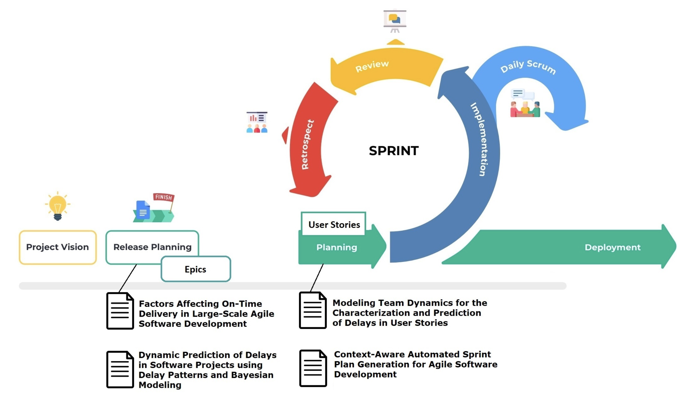

The research area of software analytics seeks to leverage data collected from software engineering processes to improve the effectiveness and efficiency of these processes. Data collected for these purposes include issues, log data, source code repositories, epic descriptions, etc. Thanks to the abundance of data, it becomes increasingly viable to apply machine learning techniques (e.g., random forests, support vector machines, neural networks) to use historic development information to support current development activities.

In the ING context, this is particularly relevant for the over 600 teams involved in software development. A key concern is epic predictability and epic delay which are addressed within this track. The research has focused on delay factors, dynamic delay prediction, team dynamics, and automated sprint optimization. 

### Selected publications:

- Elvan Kula. Modeling Effort Estimation and Planning in Large-Scale Agile Software Development. PhD thesis, Delft University of Technology, April 2025.

- Elvan Kula, Arie van Deursen, Georgios Gousios. Context-Aware Automated Sprint Plan Generation for Agile Software Development. Proceedings of the 39th IEEE/ACM International Conference on Automated Software Engineering. 2024. 🏆 ACM SIGSOFT Distinguished Paper Award. DOI: [10.1145/3691620.3695540](doi.org/Elvan Kula, Arie van Deursen, Georgios Gousios).

- Elvan Kula, Eric Greuter, Arie van Deursen, Georgios Gousios:
Dynamic Prediction of Delays in Software Projects Using Delay Patterns and Bayesian Modeling. FSE 2023 ([preprint](https://arxiv.org/abs/2309.12449)).

- Elvan Kula, Eric Greuter, Arie van Deursen, Georgios Gousios:
Factors Affecting On-Time Delivery in Large-Scale Agile Software Development. IEEE Trans. Software Eng. 48(9): 3573-3592, 2022 ([open access link](https://doi.org/10.1109/TSE.2021.3101192)).

- Elvan Kula, Arie van Deursen, Georgios Gousios:
Modeling Team Dynamics for the Characterization and Prediction of Delays in User Stories. ASE 2021: 991-1002 ([preprint](https://research.tudelft.nl/en/publications/modeling-team-dynamics-for-the-characterization-and-prediction-of)).

- Hennie Huijgens, Ayushi Rastogi, Ernst Mulders, Georgios Gousios, Arie van Deursen:
Questions for data scientists in software engineering: a replication. ESEC/SIGSOFT FSE 2020: 568-579 ([preprint](https://research.tudelft.nl/en/publications/questions-for-data-scientists-in-software-engineering-a-replicati)).

- Elvan Kula, Ayushi Rastogi, Hennie Huijgens, Arie van Deursen, Georgios Gousios: Releasing fast and slow: an exploratory case study at ING. ESEC/SIGSOFT FSE 2019: 785-795 ([preprint](https://research.tudelft.nl/en/publications/releasing-fast-and-slow-an-exploratory-case-study-at-ing)).

- Hennie Huijgens, Eric Greuter, Jerry Brons, Evert A. van Doorn, Ioannis Papadopoulos, Francisco Morales Martinez, Mauricio Finavaro Aniche, Otto Visser, Arie van Deursen:
Factors affecting cloud infra-service development lead times: a case study at ING. ICSE (SEIP) 2019: 233-242 ([preprint](https://research.tudelft.nl/en/publications/factors-affecting-cloud-infra-service-development-lead-times-a-ca)).

- Hennie Huijgens, Davide Spadini, Dick Stevens, Niels Visser, Arie van Deursen: Software analytics in continuous delivery: a case study on success factors. ESEM 2018: 25:1-25:10 ([preprint](https://research.tudelft.nl/en/publications/software-analytics-in-continuous-delivery-a-case-study-on-success)).

