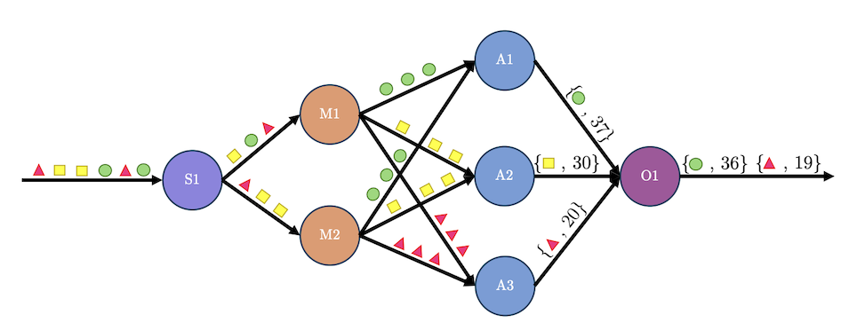

The data integration track recognizes the importance of data for almost any application of artificial intelligence at ING.
ING is a data-rich organization. Its data lake constitutes a federation of different data storage types. A plethora of applications exchange data streams. The relationships between the many different data sources evolve over time, and are hard to predict and manage.

The goal of this track is to use semantics-based data matching to recognize such data relationships automatically. In particular, we apply machine learning for the purpose of meta-data matching, automated schema discovery, schema evolution, and schema alignment. The results can be used to support data engineers to make data integration decisions by means of dataset exploration, discovery, and integration recommendation.

The context is the ING cloud infra-service platform, which continuously collects operational data from a large range of private cloud services operated by ING across layers.

Research results include:

- Valentine, a framework for matching tabular data at scale.
- An adaptive distributed streaming solution for similarity joins. It employs a stream partitioning scheme that provides fine-grained partitions, which ensure the completeness of the results while reducing the number of unnecessary computations.
- An open-source streaming dataflow testbed that allows for accurate and isolated comparison of different checkpointing protocols and can be easily extended to compare other stream processing mechanisms.
- The first principled evaluation framework for stream processing autoscalers

The results have been presented at top conferences in the area of databases, and where relevant evaluated on ING (infra-service) data.
The results are collectively described in the dissertation of PhD candidate George Siachamis (defense date: November 2024).

## Selected publications

1. George Siachamis. Adaptivity for Streaming Dataflow Engines. 2024. Doctoral Thesis. [Link to thesis](https://resolver.tudelft.nl/uuid:7d364f56-d84a-4cb0-84cb-4c317d275373).

1. George Siachamis, Kyriakos Psarakis, Marios Fragkoulis, Arie van Deursen, Paris Carbone, Asterios Katsifodimos. CheckMate: Evaluating Checkpointing Protocols for Streaming Dataflows. IEEE 40th International Conference on Data Engineering (ICDE), 2024. [Preprint](https://arxiv.org/pdf/2403.13629).

1. George Siachamis, George Christodoulou, Kyriakos Psarakis, Marios Fragkoulis, Arie van Deursen, Asterios Katsifodimos. Evaluating stream processing autoscalers. Proceedings of the 18th ACM International Conference on Distributed and Event-based Systems, 2024. [Preprint](https://giorgoschristodoulou.github.io/George_Christodoulou_ESPA.pdf).

1. G. Siachamis, K. Psarakis, M. Fragkoulis, Odysseas Papapetrou, A. van Deursen, A Katsifodimos (2023), Adaptive Distributed Streaming Similarity Joins, Marcelo Pasin (Eds.), In DEBS '23: Proceedings of the 17th ACM International Conference on Distributed and Event-based Systems p.25-36 ([preprint](https://research.tudelft.nl/en/publications/adaptive-distributed-streaming-similarity-joins)).

1. George Siachamis, Job Kanis, Wybe Koper, Kyriakos Psarakis, Marios Fragkoulis, Arie Van Deursen, Asterios Katsifodimos (2023), Towards Evaluating Stream Processing Autoscalers, In Proceedings - 2023 IEEE 39th International Conference on Data Engineering Workshops, ICDEW 2023 p.95-99, Institute of Electrical and Electronics Engineers (IEEE) ([preprint](https://research.tudelft.nl/en/publications/towards-evaluating-stream-processing-autoscalers)).

1. G. Siachamis, G.J.P.M. Houben, A. van Deursen, A Katsifodimos (2021), Integrating Massive Data Streams, Philip A. Bernstein , Tilmann Rabl (Eds.), In Proceedings of the VLDB 2021 PhD Workshop Volume 2971, CEUR-WS ([preprint](https://research.tudelft.nl/en/publications/integrating-massive-data-streams)).

1. Christos Koutras, Kyriakos Psarakis, George Siachamis, Andra Ionescu, Marios Fragkoulis, Angela Bonifati, Asterios Katsifodimos (2021), Valentine in Action: Matching Tabular Data at Scale, In Proceedings of the VLDB Endowment Volume 14 p.2871–2874 ([preprint](https://research.tudelft.nl/en/publications/valentine-in-action-matching-tabular-data-at-scale) and [dataset](https://delftdata.github.io/valentine/)).

1. Christos Koutras, George Siachamis, Andra Ionescu, Kyriakos Psarakis, Jerry Brons, Marios Fragkoulis, Christoph Lofi, Angela Bonifati, Asterios Katsifodimos (2021), Valentine: Evaluating Matching Techniques for Dataset Discovery, In Proceedings - 2021 IEEE 37th International Conference on Data Engineering, ICDE 2021 p.468-479, IEEE ([preprint](https://research.tudelft.nl/en/publications/valentine-evaluating-matching-techniques-for-dataset-discovery) and [dataset](https://delftdata.github.io/valentine/)).