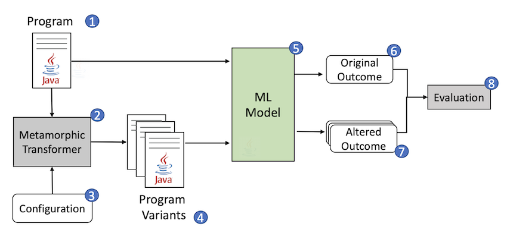

Over the past years, the software engineering research community has booked substantial progress in applying a variety of AI techniques to challenges of the software development process.

In many cases such ML-based software engineering tools give useful and meaningful results, for instance in the areas of program summarization or vulnerability detection. But how robust are such approaches? In this track we explore the use of _metamorphic transformations_ to understand whether such language model based tools maintain the required levels of performance when semantics-preserving transformations (such as refactorings or variable renamings) are applied the program under analysis.

A second successful line in AI-based software engineering relates to reformulating software engineering processes as _search-based problems_. 
In particular, _program repair_ can be considered as a _search_ for the right fix in a set of prossible code changes.
This requires a notion of correctness (a test suite that a correct fix should pass) as well as a fitness function that can guide the search process to a candidate fix that gets closer and closer to a proper fix.
In this track, we explore how such search-based program repair can leverage new types of test suites (such as property-based test suites) and sophisticated compiler infrastructure such as available in functional programming.

Research results include:

- Lampion, a framework for meta-morphic testing of machine-learning based program analysis tools
- A search-based approach to assess the robustness of ML-based program analysis tools
- PropR, a tool for property-based automated program repair for functional programming languages relying evolutionary search.
- A novel approach to conduct spectrum-based fault localization in functional programming

The results have been presented at top conferences in the area of software engineering. The results are collectively described in the dissertation of PhD candidate Leonhard Applis (defense date: September 2024).

## Selected publications

1. Leonhard Applis. Tool-Driven Quality Assurance For Functional Programming And Machine Learning. 2024. Doctoral Thesis. [Link to thesis](https://resolver.tudelft.nl/uuid:4d048249-e59d-4a82-9e11-714b2b25163f).

1. Leonhard Applis, Matthías Páll Gissurarson, Annibale Panichella:
Suspicious Types and Bad Neighborhoods: Filtering Spectra with Compiler Information. ICST 2025: 233-243. ([paper](https://research.tudelft.nl/en/publications/suspicious-types-and-bad-neighborhoods-filtering-spectra-with-com))

1. Leonhard Applis, Ruben Marang, Annibale Panichella (2023). Searching for Quality: Genetic Algorithms and Metamorphic Testing for Software Engineering ML. The Genetic and Evolutionary Computation Conference (GECCO 2023) ([preprint](https://research.tudelft.nl/en/publications/searching-for-quality-genetic-algorithms-and-metamorphic-testing-)).

1. Leonhard Applis, Annibale Panichella (2023). HasBugs - Handpicked Haskell Bugs. Mining Software Repositories (MSR) ([preprint](https://research.tudelft.nl/en/publications/hasbugs-handpicked-haskell-bugs)).

1. Matthías Páll Gissurarson, Leonhard Herbert Applis: CSI: Haskell - Tracing Lazy Evaluations in a Functional Language. IFL 2023: 1:1-1:13. ([preprint](https://research.tudelft.nl/en/publications/csi-haskell-tracing-lazy-evaluations-in-a-functional-language))

1. Matthías Páll Gissurarson, Leonhard Applis, Annibale Panichella, Arie van Deursen, David Sands (2022). PropR: Property-Based Automatic Program Repair. The 44th IEEE/ACM International Conference on Software Engineering (ICSE 2022)  ([preprint](https://research.tudelft.nl/en/publications/propr-property-based-automatic-program-repair)).

1. Leonhard Applis, Annibale Panichella, Arie van Deursen (2021). Assessing Robustness of ML-Based Program Analysis Tools using Metamorphic Program Transformations. The 36th IEEE/ACM International Conference on Automated Software Engineering - New Ideas and Emerging Results (ASE-NIER 2021) ([preprint](https://research.tudelft.nl/en/publications/assessing-robustness-of-ml-based-program-analysis-tools-using-met)).

## Other Activities

-   **Talk.** Arie van Deursen. Explainable Software Engineering. Keynote address at Bit & Chips, October 2023, Eindhoven, The Netherlands. Slides: <https://speakerdeck.com/avandeursen/explainable-software-engineering>

-   **Talk.** Arie van Deursen. FinTech: A Fertile Ground for Software Engineering Research. Presentation at the Interdisciplinary Centre for Security, Reliability and Trust (SnT), Luxembourg. June 2023.
