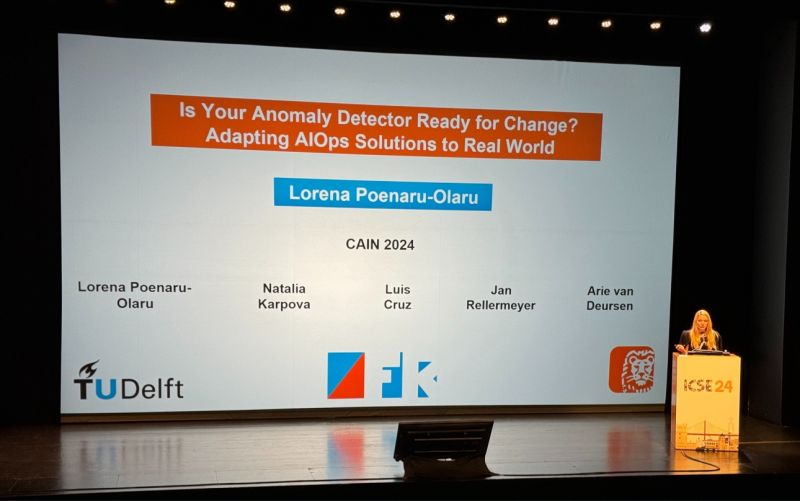

The deployment of ML-applications brings in a unique set of engineering challenges. 
If the underlying data changes, this may lead to _concept drift_. We explore the use of _drift detectors_ to identify such situations, to minimize the (typically costly) training phase. 
Such drift detectors are employed while operating machine learning models, giving rise to the field of _ML-Ops_.

In this track, we explore various aspects of ML-Ops. This includes life cycle models for ML-based systems, data or project smells in ML-based systems, and energy consumption of such systems.
Concerning drift detection, we empirically compare detectors based on error rates and those based on data distribution, using synthetic and real world data. Furthermore, we investigate how drift detectors help in the context of monitoring IT infrastructure in production.

Research results include:

- An empirical comparison of state of the art drift detectors for ML models
- An analysis of the impact of selective retraining on energy consumption and accuracy
- Application of drift detection approaches in the ING AIOps context
- An assessment of AI lifecycle models and their applicability in the ING domain

The results have been presented at international workshops and conferences in the areas of big data, sustainability, and AI engineering. The results are collectively described in the dissertation of PhD candidate Lorena Poenaru-Olaru (defense date: fall 2025). After four successful years at TU Delft, in 2024 Lorena joined ING as a data scientist in the Real Estate Finance team.

## Selected publications

1. Lorena Poenaru-Olaru, June Sallou, Luís Cruz, Jan Rellermeyer, Arie van Deursen (2025). Sustainable Machine Learning Retraining: Optimizing Energy Efficiency Without Compromising Accuracy. ICT4S

1. Lorena Poenaru-Olaru, Natalia Karpova, Luis Cruz, Jan S Rellermeyer, Arie van Deursen. Is Your Anomaly Detector Ready for Change? Adapting AIOps Solutions to the Real World. Proceedings of the IEEE/ACM 3rd International Conference on AI Engineering-Software Engineering for AI (CAIN), 2024. [Preprint](https://arxiv.org/pdf/2311.10421).

1. Jurriaan Den Toonder, Paul Braakman, Thomas Durieux. S.C.A.L.E: A CO2-Aware Scheduler for OpenShift at ING. FSE 2024: Companion Proceedings of the 32nd ACM International Conference on the Foundations of Software Engineering. [Open Access](https://dl-acm-org.tudelft.idm.oclc.org/doi/10.1145/3663529.3663862)

1. Lorena Poenaru-Olaru, Luis Cruz, Jan S. Rellermeyer, Arie van Deursen: Maintaining and Monitoring AIOps Models Against Concept Drift. CAIN 2023: 98-99. ([preprint](https://research.tudelft.nl/en/publications/maintaining-and-monitoring-aiops-models-against-concept-drift))

1. Arumoy Shome, Luís Cruz, Arie van Deursen: Towards Understanding Machine Learning Testing in Practise. CAIN 2023: 117-118. ([preprint](https://research.tudelft.nl/en/publications/towards-understanding-machine-learning-testing-in-practise))

1. Lorena Poenaru-Olaru, June Sallou, Luis Cruz, Jan S. Rellermeyer, Arie van Deursen: Retrain AI Systems Responsibly! Use Sustainable Concept Drift Adaptation Techniques. GREENS@ICSE 2023: 17-18 ([preprint](https://research.tudelft.nl/en/publications/retrain-ai-systems-responsibly-use-sustainable-concept-drift-adap)).

1. Arumoy Shome, Luís Cruz, Arie van Deursen: Data smells in public datasets. CAIN 2022: 205-216. ([preprint](https://research.tudelft.nl/en/publications/data-smells-in-public-datasets))

1. Lorena Poenaru-Olaru, Luis Cruz, Arie van Deursen, Jan S. Rellermeyer: Are Concept Drift Detectors Reliable Alarming Systems? - A Comparative Study. IEEE Big Data 2022: 3364-3373 ([preprint](https://research.tudelft.nl/en/publications/are-concept-drift-detectors-reliable-alarming-systems-a-comparati)).

1. Haiyin Zhang, Luís Cruz, Arie van Deursen: Code smells for machine learning applications. CAIN 2022: 217-228. ([preprint](https://research.tudelft.nl/en/publications/code-smells-for-machine-learning-applications))

1. Bart van Oort, Luis Cruz, Babak Loni, Arie van Deursen: "Project smells" - Experiences in Analysing the Software Quality of ML Projects with mllint. ICSE (SEIP) 2022: 211-220. ([preprint](https://research.tudelft.nl/en/publications/project-smells-experiences-in-analysing-the-software-quality-of-m))

1. Lorena Poenaru-Olaru, Judith Redi, Arthur Hovanesyan, Huijuan Wang: Default Prediction Using Network Based Features. COMPLEX NETWORKS 2021: 732-743. ([preprint](https://research.tudelft.nl/en/publications/default-prediction-using-network-based-features))

1. Lorena Poenaru-Olaru: AutoML: towards automation of machine learning systems maintainability. Middleware Doctoral Symposium 2021: 4-5. ([preprint](https://research.tudelft.nl/en/publications/automl-towards-automation-of-machine-learning-systems-maintainabi))

1. Bart van Oort, Luis Cruz, Maurício Aniche, Arie van Deursen: The Prevalence of Code Smells in Machine Learning projects. WAIN@ICSE 2021: 35-42. ([preprint](https://research.tudelft.nl/en/publications/the-prevalence-of-code-smells-in-machine-learning-projects))

1. Yuanhao Xie, Luis Cruz, Petra Heck, Jan S. Rellermeyer: Systematic Mapping Study on the Machine Learning Lifecycle. WAIN@ICSE 2021: 70-73 ([preprint](https://research.tudelft.nl/en/publications/systematic-mapping-study-on-the-machine-learning-lifecycle))

1. Mark Haakman, Luis Cruz, Hennie Huijgens, Arie van Deursen: AI lifecycle models need to be revised: An exploratory study in Fintech. Empir. Softw. Eng. 26(5): 95 (2021) [arxiv.org/abs/2010.02716](https://arxiv.org/abs/2010.02716).

## Other Activities

- **ICAI Spotlight**: PhD student Lorena about her experiences in the AI4FinTech Research Lab. <https://www.icai.ai/news/phd-student-lorena-about-her-experiences-in-the-ai4fintech-research-lab>
- Talk at **Data Science Community Conference** within ING Netherlands (2022) - Automating Machine Learning Model Maintenance and Monitoring.
- Talk at **MLOps Community Meetup Amsterdam** 2024 - Towards Understanding the Behavior of Deployed Models Over Time: A Study Case on AIOps.
- Talk at Data Science Guild within Exact Netherlands 2024 - Handling Large Complex Software using AIOps Techniques.
