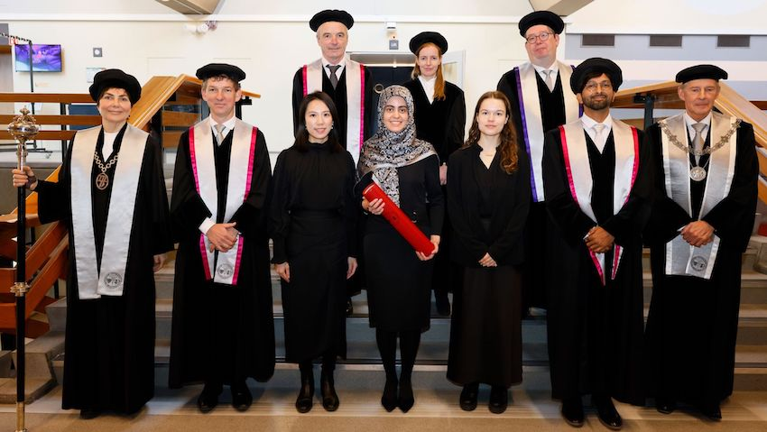

Application of artificial intelligence in high stakes domains centers around human-AI decision making in which human stakeholders interact with AI.
Examples in the financial sector include Know Your Customer (KYC) and Customer Due Dilligence (CDD) processes set in place to prevent banks from being used, intentionally or unintentionally, by criminal elements for money laundering activities.

Current advances in Natural Language Processing (NLP) open up new possibilities to strengthen KYC and CDD activities.
Written documents from regulators describe the constraints and requirements banks and their customers must adhere to.
The assessment of compliance is based on a series of data sources, which can be structured (stored in databases, queried by SQL) or unstructured, in which case it is, again, written plain text.
The route explored in the context of AFR is to use NLP to distill the requirements from regulatory documents automatically. With that in place, customer-related data, can be used to assess compliance. Here, again, for the unstructured parts, NLP techniques need be applied to distill elements that can be used for formal compliance evaluation.

Key research results include:

- A rigorous empirical analysis of the impact of task complexity and uncertainty in human-AI decision making
- An operationalization of task complexity along static (components, coordination) as well as dynamic (emerging information cues, variable) dimensions in the context of human-AI decision making
- An exploration on decomposing complex user questions to support text-to-sql tasks

The results have been presented at top conferences in the area of human-computer interaction and information retrieval, and include a honrable mention for best student paper at the International Conference on Theory of Information Retrieval (ICTIR).
The results are collectively described in the dissertation of PhD candidate Sara Salimzadeh (defense date: December 2024).

## Selected Publications

1. Sara Salimzadeh. Living in the Age of AI: Understanding Contextual Factors that Shape Human-AI Decision-Making. 2024. Doctoral Thesis. [Link to thesis](https://resolver.tudelft.nl/uuid:8eddbb29-47d2-4344-8b93-aef440c1628a).

1. Sara Salimzadeh, Ujwal Gadiraju. “DecisionTime”: A Configurable Framework for Reproducible Human-AI Decision-Making Studies. Adjunct Proceedings of the 32nd ACM Conference on User Modeling, Adaptation and Personalization, 2024. DOI: [10.1145/3631700.3664885](doi.org/10.1145/3631700.3664885).

1. Sara Salimzadeh, Ujwal Gadiraju. When in Doubt! Understanding the Role of Task Characteristics on Peer Decision-Making with AI Assistance. Proceedings of the 32nd ACM Conference on User Modeling, Adaptation and Personalization, 2024. [Preprint](https://pure.tudelft.nl/ws/portalfiles/portal/212873760/3627043.3659567.pdf).

1. Sara Salimzadeh, Gaole He, Ujwal Gadiraju. Dealing with Uncertainty: Understanding the Impact of Prognostic Versus Diagnostic Tasks on Trust and Reliance in Human-AI Decision Making. Proceedings of the CHI Conference on Human Factors in Computing Systems, 2024. [Preprint](http://ujwalgadiraju.com/Publications/CHI2024a.pdf).

1. Sara Salimzadeh, Gaole He, Ujwal Gadiraju: A Missing Piece in the Puzzle: Considering the Role of Task Complexity in Human-AI Decision Making. UMAP 2023: 215-227 ([preprint](https://research.tudelft.nl/en/publications/a-missing-piece-in-the-puzzle-considering-the-role-of-task-comple)).

1. Sara Salimzadeh, Ujwal Gadiraju, Claudia Hauff, Arie van Deursen: Exploring the Feasibility of Crowd-Powered Decomposition of Complex User Questions in Text-to-SQL Tasks. HT 2022: 154-165 ([preprint](https://research.tudelft.nl/en/publications/exploring-the-feasibility-of-crowd-powered-decomposition-of-compl))

1. Sara Salimzadeh, David Maxwell, Claudia Hauff: The Impact of Entity Cards on Learning-Oriented Search Tasks. ICTIR 2021: 63-72 ([preprint](https://research.tudelft.nl/en/publications/the-impact-of-entity-cards-on-learning-oriented-search-tasks)).

### Other Activities

- **Award.** Sara Salimzadeh (2021) 🏆 Honorable Mention for Best Student Paper. International Conference on Theory of Information Retrieval (ICTIR)