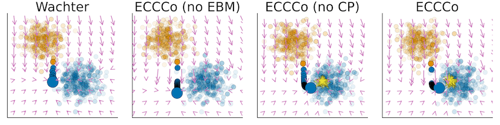

More and more software services in the banking domain rely on machine learning. This makes it crucial that the outcomes of the machine learning procedures in these services can be trusted. To be able to assess this, the [7 key requirements of the EU’s Ethics Guidelines for Trustworthy Artificial Intelligence](https://ec.europa.eu/futurium/en/ai-alliance-consultation) (Human agency and oversight; Technical Robustness and safety; Privacy and data governance; Transparency; Diversity, non-discrimination and fairness; Societal and environmental well-being; Accountability) will need concrete operationalization for the Fintech domain.

In several previous applications of machine learning (and statistical modeling), it has been found that concepts of ‘trust in’ and ‘correctness of’ models are not always clear-cut. Models that seem to perform well according to common performance metrics, may show unexpected behavior in the wild. Seemingly minor researcher degrees of freedom may have major outcomes on final results, and model outcomes may be misinterpreted, even by data scientists.

In this track, we approach trustworthy and explainable artificial intelligence from the perspective of _counterfactuals_: small perturbations to input values that lead to different model outcomes. Such counterfactuals can provide _recourse_, offering people means to strategically alter their behavior so that models do give desired outcomes.
We start from existing counterfactual generation approaches proposed by Wachter.
We explore impact classification boundaries when large parts of the population start relying on recourse (e.g., when a substantial part of a bank's customers engage in loans they can barely afford).
Furthermore, we explore new ways of generating counterfactuals relying on _conformal prediction_ and a model's _energy_.

Key research results include:

- [Taija](https://taija.org), an open source suite of Julia packages for trustworthy artificial intelligence in Julia, covering model explainability, algorithmic recourse, predictive uncertainty quantification, Bayesian deep learning, and hybrid learning.
- ECCCo, a technique for providing faithful model explanations through energy-constrained conformal counterfactuals.
- An exploration of the macrodynamics of algorithmic recourse, when classification boundaries are shifting due to recourse being followed.
- A critique of Artificial General Intelligence claims presently popular in the realm of Large Language Models.

The results have been presented at international workshops and conferences in the area AI. The results are collectively described in the dissertation of PhD candidate Patrick Altmeyer (defense date: fall 2025).

### Selected Publications

1. Patrick Altmeyer, Mojtaba Farmanbar, Arie van Deursen, Cynthia CS Liem. Faithful Model Explanations through Energy-Constrained Conformal Counterfactuals. Proceedings of the AAAI Conference on Artificial Intelligence, 2024. [Preprint](https://arxiv.org/pdf/2312.10648).

1. Floris den Hengst, Ralf Wolter, Patrick Altmeyer, Arda Kaygan. Conformal Intent Classification and Clarification for Fast and Accurate Intent Recognition. Findings of the Association for Computational Linguistics: NAACL 2024. [Publication](https://aclanthology.org/2024.findings-naacl.156/)

1. Patrick Altmeyer, Andrew M. Demetriou, Antony Bartlett, Cynthia C. S. Liem. Position: Stop Making Unscientific AGI Performance Claims. Proceedings of the 41st International Conference on Machine Learning. [Preprint](https://arxiv.org/pdf/2402.03962)

1. Patrick Altmeyer, Arie van Deursen, Cynthia C. S. Liem. Explaining Black-Box Models through Counterfactuals. JuliaCon Proceedings, 1(1), 130, 2023 ([preprint](https://doi.org/10.21105/jcon.00130)).

1. Endogenous Macrodynamics in Algorithmic Recourse. P Altmeyer, G Angela, A Buszydlik, K Dobiczek, A van Deursen, Cynthia S. Liem. IEEE Conference on Secure and Trustworthy Machine Learning (SaTML), 418-431, 2023 ([preprint](https://openreview.net/pdf?id=-LFT2YicI9v))

### Other Activities

-	**Award.** Patrick Altmeyer (2023). 2nd prize in Pluto Notebook Competition, JuliaCon2023.
-	**Award.** Patrick Altmeyer (2023). 1st Prize Winner at ING Experiment Week 2023.
-	**Toolset.** Trustworthy Artificial Intelligence in Julia (Taija). This track has resulted into a number of packages in Julia, available at <https://www.taija.org>.
-	**Tool.** Patrick Altmeyer et al. (2023–). ConformalPrediction. <https://github.com/JuliaTrustworthyAI/ConformalPrediction.jl> (Note: over 100 stars on Github)
-	**Tool.** Patrick Altmeyer et al. (2023–). CounterfactualExplanations. <https://github.com/JuliaTrustworthyAI/CounterfactualExplanations.jl> (Note: 100+ stars and 10+ contributors on Github)
-	**Talk.** Patrick Altmeyer (2024). Multiple talks at JuliaCon 2024. <https://pretalx.com/juliacon2024/speaker/8DGYCX/>
-	**Talk.** Mojtaba Farmanbar (2024). Uncertainty quantification: How much can you trust your machine learning models. PyData Amsterdam.
-	**Talk.** Patrick Altmeyer. Against Spurious Sparks - Dovelating Inflated AI Claims 🕊️. ECONDAT 2024, London.
-   **Talk.** Arie van Deursen. Explainable Software Engineering. Keynote address at Bit & Chips, October 2023, Eindhoven, The Netherlands. Slides: <https://speakerdeck.com/avandeursen/explainable-software-engineering>
-   **Talk.** Arie van Deursen. FinTech: A Fertile Ground for Software Engineering Research. Presentation at the Interdisciplinary Centre for Security, Reliability and Trust (SnT), Luxembourg. June 2023.

