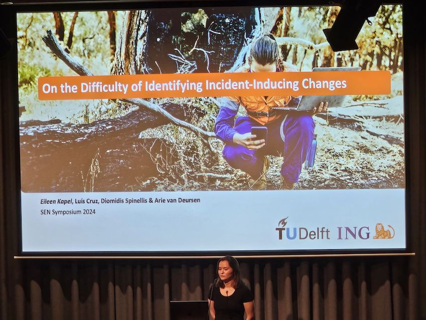

Ensuring the reliability of changes deployment is essential to prevent incidents in businesses that strongly depend on software and services. Incidents should be avoided since they may lead to customer dissatisfaction, financial losses and reputational damage. Currently, the majority of outages are being caused by changes, so we believe there is a need for a higher focus on the risk management pre-change deployment. 

This track relates to a risk management AIOps framework utilising real-world change, CI/CD pipeline and incident data for incident prevention through reliable changes deployment. This research explores

1. obtaining background information on the current state of practice of service management with a case study on a software-defined business;
2. a risk management AIOps framework that utilises the traces of change, incident and CI/CD pipeline code for predicting the risk of changes deployment; and
3. testing the generalisability of the framework for reducing the risk of change deployment in the context of ING.

Key research results include:

- An empirical analysis of incident management processes in the financial sector, and ING in particular
- A rigorous identification of key challenges need to be addressed in order to support reliable change deployment
- An incident probability scoring technique to reduce the risk of incident-inducing changes being taken into production, trained and evaluated on ING operational data.

The results have been presented at international workshops and conferences in software engineering. The results are collectively described in the dissertation of PhD candidate Eileen Kapel (defense date: fall 2025).

### Selected publications

1. On the Difficulty of Identifying Incident-Inducing Changes. Eileen Kapel, Luis Cruz, Diomidis Spinellis, Arie Van Deursen. Proceedings of the 46th International Conference on Software Engineering: Software Engineering in Practice (ICSE-SEIP), 2024. [Preprint](https://pure.tudelft.nl/ws/portalfiles/portal/210936762/3639477.3639755.pdf).

1. Enhancing Incident Management: Insights from a Case Study at ING. Eileen Kapel, Luís Cruz, Diomidis Spinellis, Arie Van Deursen. Proceedings of the 1st IEEE/ACM Workshop on Software Engineering Challenges in Financial Firms (FinanSE), 2024. [DOI: 10.1145/3643665.3648048](https://doi.org/10.1145/3643665.3648048).

1. Incident Prevention Through Reliable Changes Deployment. Eileen Kapel. IEEE/ACM 45th International Conference on Software Engineering: Companion Proceedings (ICSE-Companion), 2023. Poster. [DOI: 10.1109/ICSE-Companion58688.2023.00055](https://doi.org/10.1109/ICSE-Companion58688.2023.00055).

1. Kapel, Eileen and Cruz, Luís and Spinellis, Diomidis and van Deursen, Arie, Incident Management in a Software-Defined Business: A Case Study. [SSRN](https://ssrn.com/abstract=4333515) abstract [4333515](https://doi.org/10.2139/ssrn.4333515).

1. Ching-Chi Chuang, Luís Cruz, Robbert van Dalen, Vladimir Mikovski, Arie van Deursen:
Removing dependencies from large software projects: are you really sure? SCAM 2022: 105-115 ([link](https://research.tudelft.nl/en/publications/removing-dependencies-from-large-software-projects-are-you-really)).

### Other Activities

- **MSc Thesis.** Joshua Azimullah, supervised by Eileen Kapel, Marlo Ploemen, Niels Greep and Arie van Deursen
- **Research Project 2024/25.** "What can we learn from incident reports?", supervised by Eileen Kapel and Diomidis Spinellis.
- **Talk.** Arie van Deursen. Explainable Fintech: A Trans-Disciplinary Perspective. Keynote address, F3C25, the FutureFintech Federated Conference, March, 2025, Luxembourg. Slides: <https://speakerdeck.com/avandeursen/explainable-fintech-a-transdisciplinary-perspective>
- **Talk.** Eileen Kapel (2024). ''Incident Prevention Through Reliable Change Deployment'' [Delft FinTech Summit: Pioneering Finance by Collaboration and Learning](https://www.tudelft.nl/evenementen/2024/delft-ai/delft-fintech-summit-2024-pioneering-finance-by-collaboration-and-learning). 
- **Talk.** Eileen Kapel (2022–24). ING's internal Reliability Event 2024, 2023 and 2022
- **Talk.** Eileen Kapel (2024). Lightning talk and Poster Presentation. [SEN Symposium 2024](https://www.sen-symposium.nl/history/2024/program/)
- **Talk.** Eileen Kapel (2024) ''Incident Prevention Through Reliable Change Deployment''. [ICAI Spotlight: AI for Fintech Research Lab](https://www.icai.ai/event/spotlight-ai-for-fintech-research-lab)
- **Talk.** Eileen Kapel and Jan Lennartz (2023). ''Enhancing Incident Prevention: Reliable Change-Incident Links and AI-Driven Risk assessment'' with . ING Bank's internal Data Science Community Conference (DSCC) 2023
- **MSc Thesis.** Ching-Chi Chuang (2022). Supervised by Luís Cruz, Robbert van Dalen, Vladimir Mikovski, Arie van Deursen.
