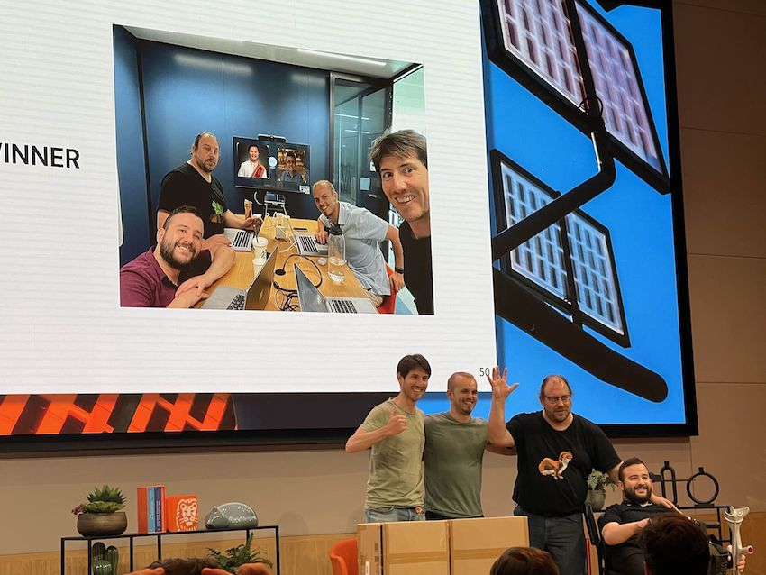

Reinforcement learning is a powerful learning paradigm that can be used to learn how to behave
optimally from data. It has become increasingly popular over the past decades for various tasks,
including personalization. However, enforcing safety requirements onto the learned behaviors
remains an open challenge. Strong guarantees on safety is a prerequisite for adoption of systems
in practice.

This research is aimed at (a) bridging the gap between regulators’ and agent’s behaviour
representation, and (b) reinforcement learning under the resulting constraints aimed at the
application of an Adaptive Personal Assistant. It touches on practical and fundamental aspects of
explainability and safety of AI. How can we formalize regulations so that domain experts can
inspect, understand and validate the result?  How can we bridge the gap between experts’ and RL
agents’ representation of the world and actions?  How does constraining a RL agent impact its
learning capabilities? In this research, we use an adaptive conversational agent for financial
advice to investigate these issues.

This research is a collaboration between ING and the Vrije
Universiteit Amsterdam's groups [Knowledge Representation and Reasoning](https://krr.cs.vu.nl/) and
[Computational Intelligence](https://cs.vu.nl/ci/) groups.
The PhD candidate, ING employee Floris den Hengst, joined AFR to strengthen connections to the research community.

Besides key research results in safe and efficient deep reinforcement learning, the PhD student from this track and from track 6 (Floris and Patrick) participated in _Experiment Week 2023_ at ING, where they managed to win by popular vote with a project on _intent recognition_ with LLMs and conformal prediction.
The team outperformed Google's commercial offering _DiaglogFlowCX_ by combining BERT, Vicuna7B, python's MAPIE and julialang's ConformalPrediction.jl (developed in track 6).

The research results have been published in key conferences and journals in artificial intelligence,
and are included in the PhD thesis of Floris den Hengst, defended November 2023 at the Vrije Universiteit, Amsterdam.

## Selected Publications

1. Floris den Hengst. Learning to Behave: Reinforcement Learning in Human Contexts. PhD thesis, Vrije Universiteit, November 2023. ([pdf](https://florisdh.nl/publications/phdthesis-digital.pdf))

1. Floris den Hengst, Vincent François-Lavet, Mark Hoogendoorn, Frank van
  Harmelen: Reinforcement Learning with Option Machines
  IJCAI-ECAI (2022). [pdf](https://florisdh.nl/publications/ijcai22-option-machines.pdf)

1. Petrescu, Stefan and den Hengst, Floris and Uta, Alexandru and Rellermeyer, Jan S., “Log Parsing Evaluation in the Era of Modern Software Systems” The 34th IEEE International Symposium on Software Reliability Engineering, IEEE, 2023. ([preprint](https://arxiv.org/abs/2308.09003))

1. Floris den Hengst, Vincent François-Lavet, Mark Hoogendoorn, Frank van
  Harmelen: Planning for potential: efficient safe reinforcement learning.
  Machine Learning, Springer (2022). [doi](https://doi.org/10.1007/s10994-022-06143-6)

1. Floris den Hengst, Mark Hoogendoorn, Frank van Harmelen, Joost Bosman: Reinforcement Learning
  for Personalized Dialogue Management. IEEE/WIC/ACM International Conference on Web Intelligence:
  59-76 (2020) [doi](https://doi.org/10.1145/3350546.3352501)

1. van Zeelt, Mickey, Floris den Hengst, and Seyyed Hadi Hashemi. "Collecting High-Quality Dialogue
  User Satisfaction Ratings with Third-Party Annotators." Proceedings of the 2020 Conference on
  Human Information Interaction and Retrieval. 2020. [doi](https://doi.org/10.1145/3343413.3377998)

1. Floris den Hengst, Eoin Grua, Ali el Hassouni, Mark Hoogendoorn: Reinforcement learning for
  personalization: A systematic literature review. Data Science: 1-4 (2020)
  [doi](https://doi.org/10.3233/DS-200028)

1. Mickey van Zeelt, Floris Den Hengst, and Seyyed Hadi Hashemi: Collecting High Quality
  Dialogue User Satisfaction Ratings with Third-Party Annotators. Proceedings of the 2020
  Conference on Human Information Interaction and Retrieval. (2020)
  [doi](https://doi.org/10.1145/3343413.3377998)

