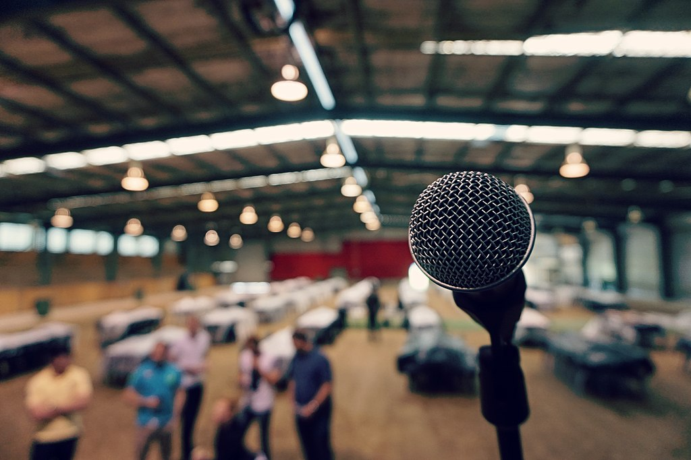

# Innovation and Impact Workshop 🦄
🗓 28 March 2022 
🗺 [Art Centre], Delft

{: height="400px"}

Research ideas are much more than a seed for brilliant academic papers.
In this workshop, we invite you to explore and reflect about the societal impact of your PhD ideas. It can be in the form of a concrete product, an open source tool, a start-up, a novel way of working, you name it.

Throughout the day, we will explore different strategies to achieve this impact, such as involving (master) students, involving software engineers or business developers, finding launching customers, attracting venture capital, creating an open source community, and so on.

We want this to be a creative day where the only limit to our possibilities is our own imagination -- think big, and anything is possible.

## Program

This program is preliminary and might be subject to change.

 ⏰&nbsp;Time&nbsp;slot | 🎤 Activity
----------------| --------------|
 09:00–09:30    | Meet and Greet. 👋
 09:30–10:00    | **Introduction:** *From Research to Innovation and Impact*. By [Arie van Deursen].
 10:00–10:15    | Coffee Break. ☕️
 10:15–11:15    | **Pitch!** 2-min pitch + 5-min Q&A 📣
 11:15-12:15    | **Group Sessions:** Explore new ideas. 
 12:15–13:30    | Lunch.🍕
 13:30-14:00    | **Keynote:** *How to pitch in the right wave-length*. By our friend in the valorisation centre.
 14:00-15:00    | **Group Sessions:** Improve your pitch.
 15:00-15:15    | Coffee Break. ☕️
 15:15-16:00    | **rePitch!** 🏅
 16:00-17:00    | Drinks & Closing Session. 🍷
 
<!-- Notes:
- it would be nice to record these pitches. They would fit well the social media platform and we could be posting throughout the next months.
- During group sessions, students improve their pitch or create a new one but all of them will pitch again.
-->

## Meet our Special Guests

- [Venkatesh Chandrasekar]
- Pitch expert

[Art Centre]: https://www.artcentredelft.com
[Arie van Deursen]: https://avandeursen.com
[Venkatesh Chandrasekar]: https://www.linkedin.com/in/venchandrasekar/
