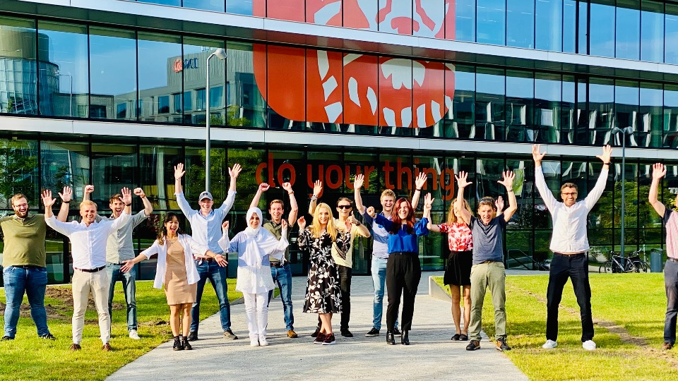

# AI for Fintech Research

AI for Fintech Research (AFR) is a five year collaboration between [ING] and [Delft University of Technology][tudelft]. The mission of AFR is to perform world-class research at the intersection of Artificial Intelligence, Data Analytics, and Software Analytics in the context of FinTech.
AFR was launched in 2020. 

With 36 million customers, activities in 42 countries, and a total of 50,000 employees of which 15,000 work in IT, software and data technology is at the heart of ING’s business and operations. In this context, AFR seeks to develop new AI-driven theories, methods, and tools in large scale data and software analytics.

The core of the AFR consists of eight research tracks, in which PhD students work on a range of topics, such as software analytics, data integration, fairness in machine learning, model life cycle management, regulatory compliance, search-based software engineering, and concept drift. In each track, researchers from TU Delft and engineers from ING are involved, as well as bachelor and master students from TU Delft.

AFR is bi-located at the TU Delft campus in Delft and at [Cumulus Park] – the collaborative innovation district in Amsterdam Southeast – bringing together students, engineers, researchers, professors, and entrepreneurs from both organizations at both locations. During the COVID-19 pandemic in 2020 and 2021, all collabaration was virtual, with hybrid meetings returning in 2022.

AFR participates in the Innovation Center for Artificial Intelligence ([ICAI]) as one of its labs. ICAI is a virtual organization consisting of a series of labs of similar size (over five PhD researchers each) working in close collaboration with societal or industrial partners. AFR directly benefits from the experience and expertise of other academic and industrial ICAI partners, such as Qualcomm, Bosch, Ahold Delhaize, the Dutch National Police, the University of Amsterdam, and Vrije Universiteit.

The AFR Lab is led by scientific director [Arie van Deursen][avandeursen] and lab managers Elvan Kula (ING) and Luís Cruz (TU Delft).

----

----

[icai]: https://icai.ai/
[tudelft]: https://tudelft.nl
[cumulus park]: https://www.cumuluspark.com
[ing]: https://ing.com
[avandeursen]: https://avandeursen.com
[serg]: https://se.ewi.tudelft.nl
[eemcs]: https://www.tudelft.nl/en/eemcs/
